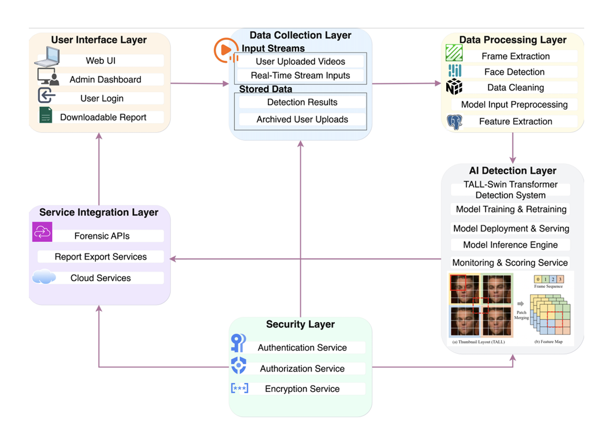

# DeepXpose: A Transformer-Based System for Deepfake Video Detection

> 🎓 Senior Graduation Project – Bachelor of Computer Science (Artificial Intelligence), Effat University

## Overview

DeepXpose is an end-to-end deepfake video detection system designed to identify manipulated videos using a transformer-based architecture. The project addresses key challenges in modern deepfake detection, including cross-dataset generalization, robustness to compression artifacts, and efficient spatio-temporal feature extraction.

The system integrates a complete AI pipeline consisting of video preprocessing, transformer-based model inference, backend APIs, database management, and a web-based user interface.

---

## Motivation

Recent advances in generative AI have made deepfake videos increasingly realistic and difficult to detect. Existing detection methods often struggle with:

- Generalization to unseen manipulation techniques
- Performance degradation on compressed or low-quality videos
- Capturing long-range temporal inconsistencies

DeepXpose addresses these challenges through the TALL-Swin Transformer architecture and an efficient preprocessing pipeline designed for robust real-world deployment.

---

## Key Features

- Transformer-based deepfake video detection
- TALL-Swin Transformer architecture
- Multi-frame video sampling
- Thumbnail-based frame aggregation (TALL)
- Secure user authentication
- Video upload and automated analysis
- Detection report generation
- Full-stack web application
- Modular AI pipeline

---

## Performance Highlights

| Metric | Result |
|--------|--------|
| Validation Accuracy | **92.1%** |
| Test Accuracy | **92.3%** |
| Average Inference Time | **~95 ms/video** |
| GPU Memory Usage | **< 1 GB** |

### Key Findings

- Achieved **92.3%** test accuracy on benchmark datasets.
- Demonstrated strong cross-dataset generalization.
- Reduced overfitting through multi-dataset training.
- Achieved near-real-time inference (~95 ms per video).
- Lightweight deployment with less than **1 GB** GPU memory usage.

---

## System Architecture


```markdown

```

---

## Methodology

The proposed system follows a modular end-to-end pipeline for deepfake video detection.

```text
Video Upload
      ↓
Frame Extraction (FFmpeg + OpenCV)
      ↓
Face Detection (MediaPipe / Dlib)
      ↓
Data Cleaning
      ↓
Thumbnail Layout (2×4 TALL)
      ↓
Normalization (224×224)
      ↓
TALL-Swin Transformer
      ↓
Binary Classification
      ↓
Prediction & Confidence Score
```

The TALL module organizes eight representative video frames into a **2×4 thumbnail layout**, preserving temporal order while enabling the Swin Transformer to jointly learn spatial and temporal inconsistencies for robust binary classification.

---

## Benchmark Datasets

The proposed model was trained and evaluated using publicly available benchmark datasets containing both authentic and manipulated videos.

- DeeperForensics-1.0
- Celeb-DF (v2)
- SDFDV

These datasets provide diverse identities, lighting conditions, compression levels, and manipulation techniques, improving the model's robustness and generalization.

---

## Training Configuration

| Parameter | Value |
|----------|-------|
| Backbone | TALL-Swin Transformer |
| Loss Function | Cross-Entropy Loss |
| Optimizer | AdamW |
| Learning Rate | 1 × 10⁻⁴ |
| Input Resolution | 224 × 224 |
| Frames per Sample | 8 |
| Thumbnail Layout | 2 × 4 (TALL) |

---

## Technology Stack

### Artificial Intelligence & Machine Learning

- Python
- PyTorch
- Torchvision
- OpenCV
- FFmpeg
- NumPy
- Pandas
- Pillow
- Scikit-learn
- CUDA

### Computer Vision

- MediaPipe
- Dlib

### Backend

- Flask
- SQLAlchemy
- JWT Authentication

### Frontend

- React
- JavaScript
- HTML
- CSS
- Bootstrap
- Axios

### Database

- SQLite

---

## Results

| Model | Accuracy |
|--------|---------:|
| XceptionNet | 85% |
| EfficientNet-B4 | 89% |
| Swin-B Transformer | 90% |
| **DeepXpose (TALL-Swin)** | **92%** |

The proposed DeepXpose system achieved:

- **92.1% validation accuracy**
- **92.3% test accuracy**
- **~95 ms** average inference time per video
- **<1 GB** GPU memory usage

The model demonstrated strong cross-dataset generalization while maintaining efficient deployment performance for near-real-time video analysis.

---

## Project Modules

- User Interface
- Data Collection
- Data Preprocessing
- AI Detection Engine
- Model Training & Fine-Tuning
- Testing & Evaluation
- Backend API
- Database Management
- Service Integration
- Security Layer

---

## Applications

- Digital Forensics
- Law Enforcement Investigations
- Social Media Content Verification
- Journalism & Fact-Checking
- Enterprise Content Moderation
- AI Security & Misinformation Detection

---

## Research Contributions

- Transformer-based deepfake video detection
- Efficient spatio-temporal feature learning using TALL encoding
- Multi-dataset training for improved generalization
- Lightweight deployment with low memory consumption
- Near-real-time inference
- End-to-end AI deployment architecture integrating preprocessing, inference, APIs, database, and user interface

---

## Repository Contents

- 📑 Project Presentation
- 🏗️ System Architecture
- 📊 Methodology
- 📈 Experimental Results
- 📝 Project Documentation

> **Note:** The source code is not included in this public repository. This repository is intended to showcase the project architecture, methodology, and research outcomes.

---

## Authors

- **Amani Albarazi**
- **Bushra Alshehri**
- **Maram Alhusami**

### Supervisors

- Dr. Fidaa Abed
- Dr. Passent Elkafrawy

### Instructor

- Dr. Naila Marir

**Effat University**  
Bachelor of Computer Science (Artificial Intelligence)

---

## Citation

If you reference this work, please cite:

> **DeepXpose: A Transformer-Based System for Deepfake Video Detection**  
> Senior Graduation Project, Effat University, 2026.
